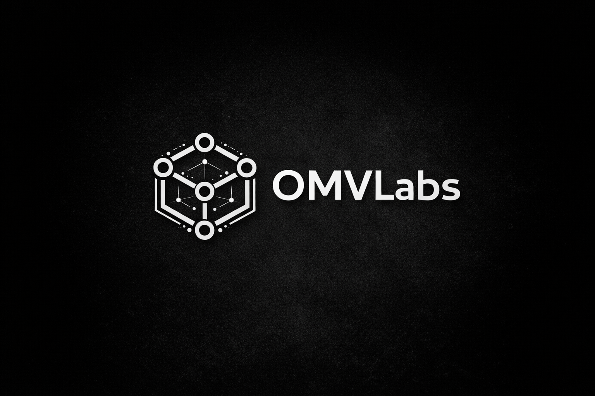

<!-- ===================== OMVLabs ===================== -->

  

  

<h1 align="center" style="font-size: 3rem; letter-spacing: 0.05em;">
  OMV Labs
</h1>

  <b>360° Open-Source Technology Organization</b> 
  Building systems, tools, and foundations across modern technology

  
  
  

---

## About

**OMV Labs** is an open-source organization focused on building and maintaining
technology projects across the broader software and systems landscape.

We operate with a **long-term engineering mindset** — prioritizing:

- clarity over cleverness  
- correctness over speed  
- sustainability over trends  

Our goal is to create software that remains useful, understandable,  
and extensible over time.

---

## Focus

OMV Labs is intentionally **domain-agnostic**.

Rather than optimizing for a single category, we build **foundational tools**
that sit underneath modern technology stacks.

Areas may include:

- Systems & infrastructure  
- Developer tooling  
- Web & backend engineering  
- Cloud-native patterns  
- Experimental and research-driven work  

The unifying principle is **strong engineering fundamentals**.

---

## Principles

  

- **Open by default**  
- **Designed to be built upon**  
- **Documentation is part of the product**  
- **Community over individual ownership**  

---

## Status

OMV Labs is currently in an **early foundation stage**.

Projects, contribution guidelines, and governance models  
will be introduced incrementally as repositories mature.

We favor **intentional growth** over rapid expansion.

---

  

  
    OMV Labs — Engineering the open future.
  

